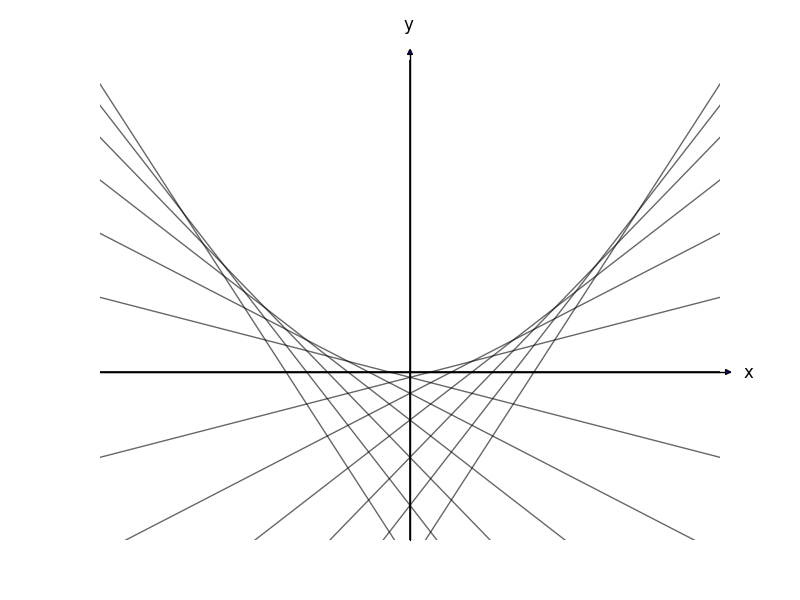
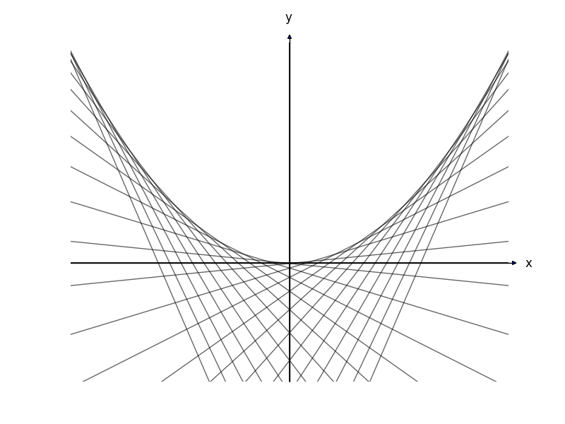

envelope
========

Draw graphs for the envelope theorem

私のプログラムの出力結果です：

[背景とコードの説明](https://docs.google.com/viewer?url=https://github.com/yohanashima/envelope/blob/master/envelope-report.pdf?raw=true)